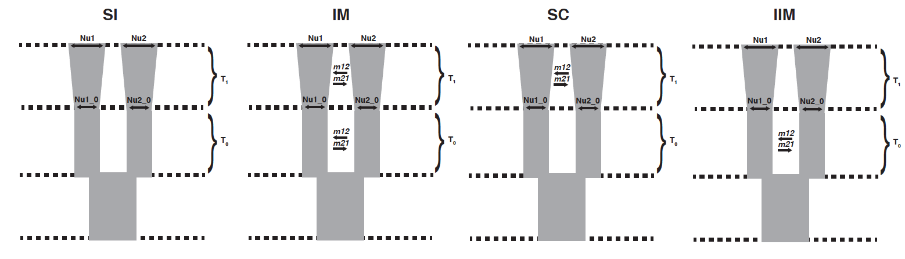
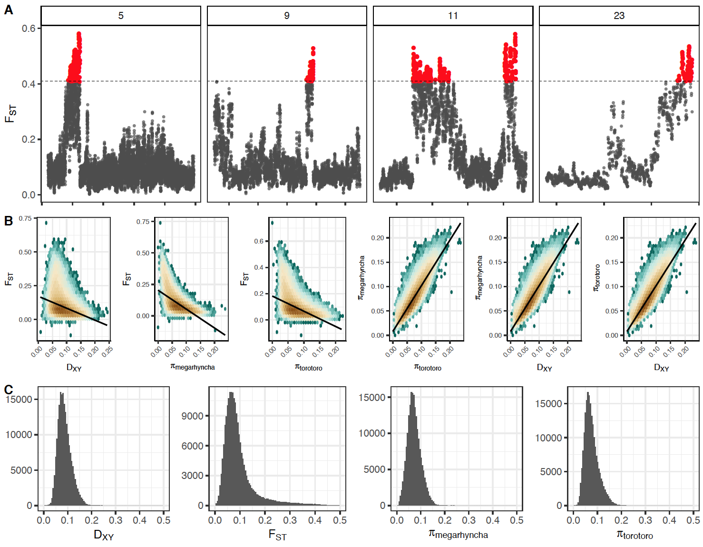

# Supplemental Material

Supplemental material for Linck et al. 2019, *bioRxiv*.

### Figures

   
**Figure S1:** Supervised population assignments from `ADMIXTURE` for *K*=3   
   
   
**Figure S2:** Diagrams of demographic models implemented in `moments`   

     
**Figure S3:** A) Pronounced peaks of relative genomic divergence on four chromosomes. B) Correlations between summary statistics of genomic diversity and divergence. C) Distributions of summary statistics  

### Tables

**Table S1:** Time scaled parameter values and standard deviations for the maximum likelihood optimization of each model tested with joint site frequency spectrum-based demographic inference in moments.

| Parameter           | IM (SD)                       | IIM (SD)                  | SC (SD)                     | SI (SD                   |
|---------------------|-------------------------------|---------------------------|-----------------------------|--------------------------|
| Nmeg_0   | 106049278.19 (10594095899.99) | 60579620.96 (27780976.82) | 1000897.40 (4239177.62)     | 9238.85 (43846.68)       |
| Ntor_0   | 159173.09 (86403707.39)       | 2545587.85 (10952902.31)  | 22683700.58 (1101240437.82) | 36584.85 (205321.52)     |
| Nmeg     | 19815.13 (1630633.17)         | 54725.12 (302722.54)      | 11001.51 (2176.37)          | 3241053.20 (18733219.57) |
| Ntor     | 12292.60 (363945.45)          | 149968.18 (733993.96)     | 29232.10 (72528.20)         | 5745.92 (35692.55)       |
| T0       | 2136554.73 (969702508.95)     | 93825473.64 (57666506.07) | 17630682.86 (903397204.23)  | 1270.08 (6066.55)        |
| T1       | 77060.64 (4003285.38)         | 60728.46 (295712.88)      | 66475.59 (377322.25)        | 1209.56 (7760.79)        |
| mmeg_tor | 0.28 (106.22)                 | 0.14 (0.01)               | 1.81 (2.62)                 | NA                       |
| mtor_meg | 2.03 (15.98)                  | 17.62 (25.08)             | 3.14 (0.09)                 | NA                       |
  
**Table S2** (`Table_S1.csv`): Locality data for sequenced samples.  